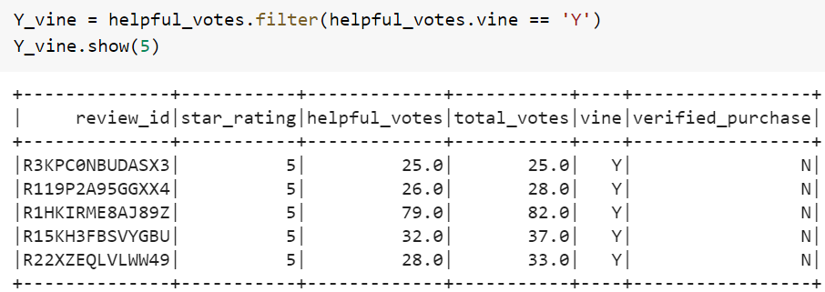
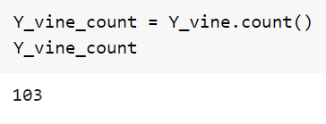
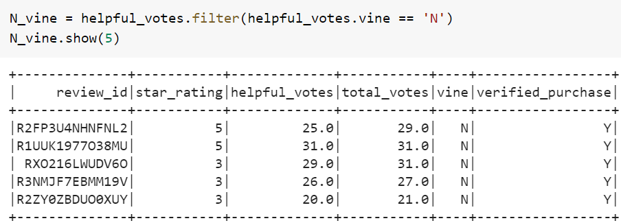
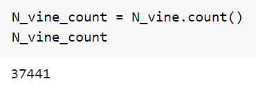
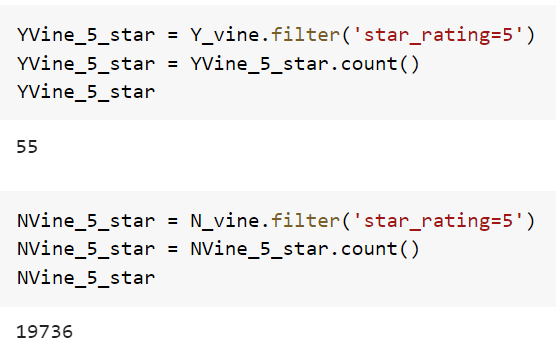
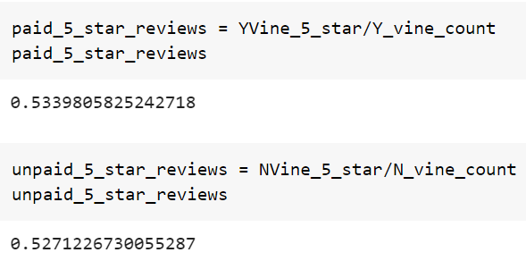

### Overview of the Analysis: 

I was recently tasked with analyzing reviews from Amazon written by members of the paid Amazon Vine Program. The Vine program is a program in which companies pay a small fee for the members to leave mandatory reviews on products in which they have purchased. The reviews are not fabricated or false and the Amazon Vine member is in no way obligated to only leave a positve review. The program is by invitation only and there are specific criteria that one must meet in which to be invited into the program.

### Purpose of the analysis:

For my analysis I used Amazon review data pertaining to items within the outdoor category. The purpose of the analysis today was to use PySpark, an AWS database and Pg-Admin(a SQL database) to Extract, Transform, Load and Analyze the Vine Program data. Initially we will take a look at the amount of reviews that were left by vine member and those from other members. We will also take a look at the quality of those reviews. Were the majority of the Vine program reviews 5 stars? Did being a Vine member sway the reviews in any meaningful way?

Note: Before the analysis was started the data was filtered to only include reviews with more than 20 total votes and then filtered additionally to only contain reviews where more than 50% were considered to be helpful. The starting amount of reviews was: 37,544.

### Results:

#### How many Vine reviews and non-Vine reviews were there?
  |  

  |  
#### How many Vine reviews were 5 stars? How many non-Vine reviews were 5 stars?

#### What percentage of Vine reviews were 5 stars? What percentage of non-Vine reviews were 5 stars?

##### Vine Program 5-Star Ratings: 53.3% | Non-Vine Program 5-Star Ratings: 52.7%

### Summary: 
In your summary, state if there is any positivity bias for reviews in the Vine program. Use the results of your analysis to support your statement. Then, provide one additional analysis that you could do with the dataset to support your statement.
